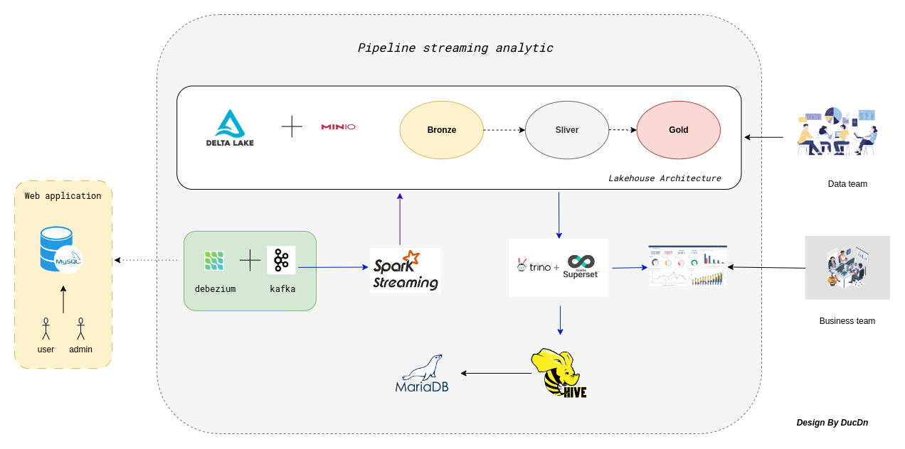
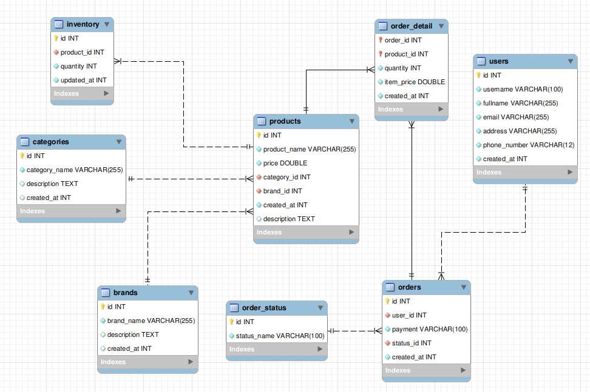

### DO AN: XAY DUNG MO HINH PHAN TICH VA XU LY DU LIEU REALTIME
---
#### Decribe data pipeline

#### Schema of database

#### Kafka Connector
- Create connector between kafka connector and mysql
```
docker exec connect curl -X POST -H "Content-Type:application/json" -d @/connect/config_connector_myshop.json http://localhost:8083/connectors

docker exec connect curl -X DELETE http://localhost:8083/connectors/myshop-connector
```
---
#### Spark
- Copy jars file into spark master and spark worker
```
docker cp ./docker-config/spark/lib/. master:/opt/spark/jars
docker cp ./docker-config/spark/lib/. worker-a:/opt/spark/jars
docker cp ./docker-config/spark/lib/. worker-b:/opt/spark/jars

docker exec -it master spark-submit --master spark://master:7077 /opt/workspace/main.py
```
---
#### Superset
- Config superset
```
docker-compose -f docker-compose-non-dev.yml up -d

docker network connect superset_default trino

docker exec -it b89  superset fab create-admin \
              --username admin \
              --firstname Superset \
              --lastname Admin \
              --email admin@superset.com \
              --password admin

docker exec -it 'superset_id' bash

pip install trino

trino://admin@trino:8080/delta
```
- SQL Command for joining tables to analyst
```
select pd.id as product_id, product_name, 
    pd.price as product_price, brand_name, category_name,
    od.quantity as order_quantity, iv.quantity  as order_remain,
    od.order_id, od.item_price as od_price, os.status_name,
    u.username, u.email, u.address
from products as pd 
    inner join catagories c 
    on pd.category_id = c.id
    inner join brands as b
    on pd.brand_id = b.id
    inner join inventory as iv
    on pd.id = iv.product_id 
    inner join order_detail as od
    on pd.id = od.product_id 
    inner join orders as o
    on od.order_id = o.id
    inner join users as u
    on o.user_id = u.id
    inner join order_status as os 
    on o.status_id = os.id
where os.id = 1;
```
- Note:
   - id: 1 => order received
   - id: 2 => processing
   - id: 3 => cancelled
   - id: 4 => Delivered
---
#### Trino
---
- Exec into trino container and use delta catalog
```
docker exec -it trino bash

trino

use delta.default
```
- use proceduce in trino to get metadata from delta table and sync with hive metastore
```
call system.register_table(schema_name => 'default', table_name => 'users', table_location => 's3a://datalake/brozen/cdc.myshop.users');

call system.register_table(schema_name => 'default', table_name => 'brands', table_location => 's3a://datalake/brozen/cdc.myshop.brands');

call system.register_table(schema_name => 'default', table_name => 'products', table_location => 's3a://datalake/brozen/cdc.myshop.products');

call system.register_table(schema_name => 'default', table_name => 'order_detail', table_location => 's3a://datalake/brozen/cdc.myshop.order_detail');

call system.register_table(schema_name => 'default', table_name => 'orders', table_location => 's3a://datalake/brozen/cdc.myshop.orders');

call system.register_table(schema_name => 'default', table_name => 'catagories', table_location => 's3a://datalake/brozen/cdc.myshop.categories');

call system.register_table(schema_name => 'default', table_name => 'inventory', table_location => 's3a://datalake/brozen/cdc.myshop.inventory');

call system.register_table(schema_name => 'default', table_name => 'order_status', table_location => 's3a://datalake/brozen/cdc.myshop.order_status');
```
